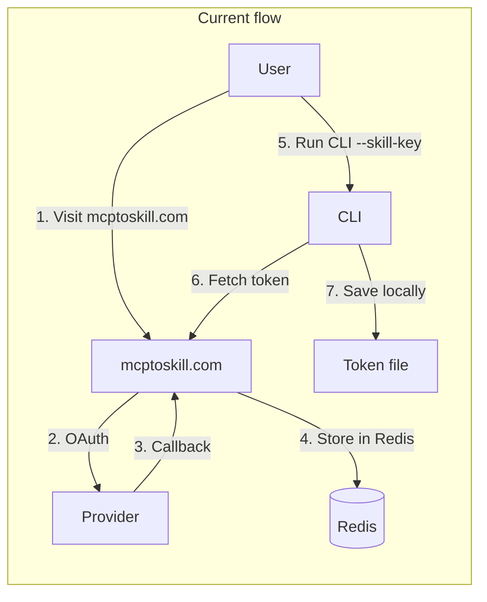
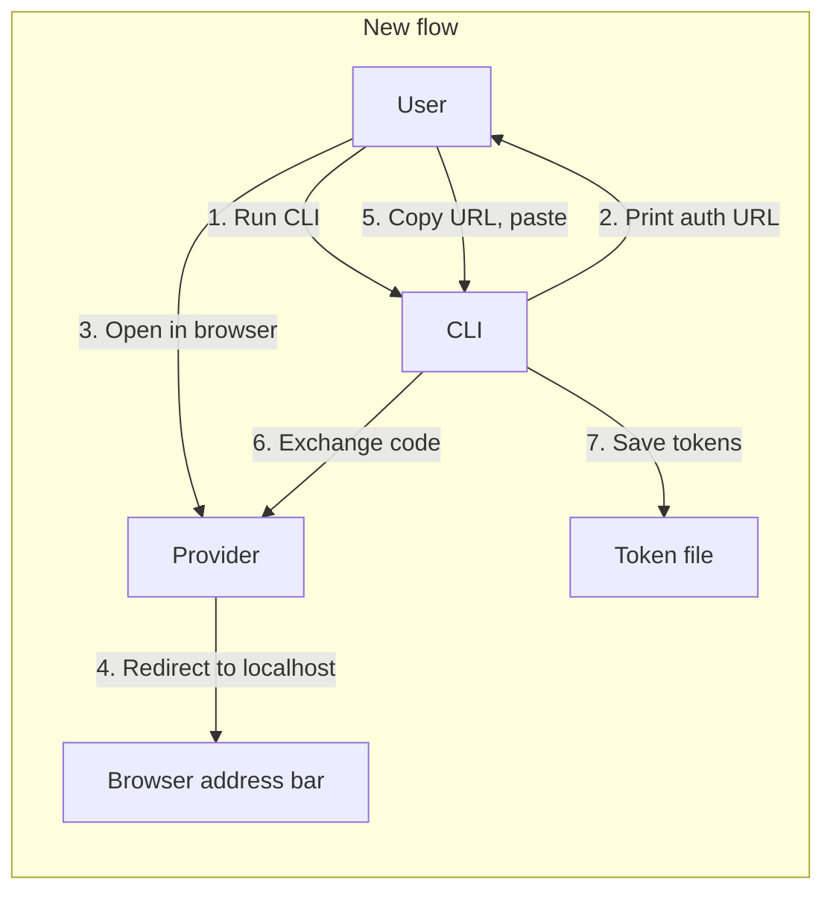

# mcptoskill Local OAuth Plan

## Goal

Replace the current OAuth flow (mcptoskill.com + Redis + skill-key) with a local flow where:

1. CLI builds the auth URL and prints it
2. User opens URL in browser, completes OAuth
3. Provider redirects to `http://localhost:3000/callback?code=...&state=...`
4. Page fails to load (nothing listening), but URL stays in address bar
5. User copies URL and pastes into CLI
6. CLI parses code, exchanges for tokens, saves to `~/.openclaw/mcptoskill/tokens/<name>.json`

No server, no mcptoskill.com trust for OAuth.

---

## Current Architecture




---

## Target Architecture




---

## Scope

**Base path:** [.openclaw/mcptoskill_code](.openclaw/mcptoskill_code)

The full repo with CLI (`src/`, `dist/`) and Vercel API (`api/`) lives in `.openclaw/mcptoskill_code`. This plan covers CLI changes in `src/` and API changes in `api/`.

---

## 1. Add Provider Config to CLI

**New file:** `src/providers.ts`

Mirror [api/_providers.ts](.openclaw/mcptoskill_code/api/_providers.ts) so the CLI can detect OAuth providers and build auth URLs. Export:

- `Provider` interface
- `PROVIDERS` array (notion, supabase, posthog)
- `getProvider(id: string)`
- `getProviderByMcpUrl(url: string)` — match by `mcpUrl` to detect provider from CLI URL arg

---

## 2. Add Local OAuth Module

**New file:** `src/oauth.ts`

### 2.1 State storage

Store PKCE `code_verifier` and `state` in a temp file so we can validate after paste:

- Path: `~/.openclaw/mcptoskill/oauth-state.json`
- Schema: `{ state, code_verifier, provider, client_id?, token_endpoint?, resource_url?, created_at }`
- TTL: 10 minutes (reject if `created_at` too old)
- Delete file after successful exchange or on error

### 2.2 Build auth URL

**MCP OAuth (Notion, PostHog):**

1. Fetch discovery from `provider.discoveryUrl`
2. Dynamic client registration with `redirect_uris: ["http://localhost:3000/callback"]`
3. Generate PKCE `code_verifier`, `code_challenge`
4. Build auth URL with `state`, `code_challenge`, `client_id`, `redirect_uri`
5. Save state to temp file

**Standard OAuth (Supabase):**

1. Require `SUPABASE_CLIENT_ID` and `SUPABASE_CLIENT_SECRET` from env
2. Generate PKCE if `provider.requiresPkce`
3. Build auth URL with `redirect_uri: "http://localhost:3000/callback"`
4. Save state to temp file

### 2.3 Prompt and parse

1. Print: `Open this URL in your browser: <auth_url>`
2. Print: `After completing OAuth, copy the URL from your browser's address bar and paste it here:`
3. Use `readline.createInterface({ input: process.stdin })` to read paste
4. Parse pasted string as URL, extract `code` and `state` query params
5. Validate `state` matches stored state
6. Load `code_verifier` from state file

### 2.4 Token exchange

1. POST to `token_endpoint` with `grant_type=authorization_code`, `code`, `redirect_uri`, `code_verifier`, `client_id` (and `client_secret` for Supabase)
2. Parse response, extract `access_token`, `refresh_token`, `expires_in`
3. Delete state file
4. Return token data in `SkillKeyResponse` shape; for Supabase, include `client_secret` so it can be saved to the token file for client-side refresh

### 2.5 Export

```ts
export async function runLocalOAuth(providerId: string, skillName: string): Promise<SkillKeyResponse>
```

---

## 3. Integrate OAuth into CLI

**File:** [src/index.ts](.openclaw/mcptoskill_code/src/index.ts)

### 3.1 Provider detection

After `parseArgs`, if URL is a known OAuth provider and neither `--header` nor `--skill-key` is set:

- Resolve provider via `getProviderByMcpUrl(url)`
- If provider exists, run `runLocalOAuth(provider.id, skillName)` instead of skill-key flow

### 3.2 Flow order

1. If `--header` provided → use header (existing behavior)
2. Else if `--skill-key` provided → fetch from mcptoskill.com (keep for backward compat, mark deprecated)
3. Else if URL matches OAuth provider → run local OAuth
4. Else → fail with "This MCP requires auth. Use --header or run with a known OAuth provider."

### 3.3 Skill name for OAuth

Use `--name` if set; otherwise derive from provider (e.g. `notion` → `notion-mcp` for Notion to match existing token file naming).

### 3.4 Supabase env check

For Supabase local OAuth, before building auth URL, check `process.env.SUPABASE_CLIENT_ID` and `process.env.SUPABASE_CLIENT_SECRET`. If missing, print:

```
Supabase OAuth requires SUPABASE_CLIENT_ID and SUPABASE_CLIENT_SECRET.
Create an OAuth app at https://supabase.com/dashboard and set these env vars.
```

---

## 4. Deprecate --skill-key

- Keep `--skill-key` working for backward compatibility
- Add deprecation notice: `console.warn("--skill-key is deprecated. Use local OAuth instead (no flag needed).")`
- Update usage/help text to show local OAuth as primary

---

## 5. Update README

**File:** [README.md](.openclaw/mcptoskill_code/README.md)

- Replace skill-key examples with local OAuth flow
- Add "Local OAuth (Notion, PostHog)" section: run `mcptoskill https://mcp.notion.com/mcp`, follow prompts
- Add "Supabase" section: requires `SUPABASE_CLIENT_ID` and `SUPABASE_CLIENT_SECRET`; create OAuth app in dashboard
- Add "VPS / headless" note: copy URL from address bar after redirect, paste into terminal
- Remove or soften "visit mcptoskill.com" for OAuth

---

## 6. Supabase: Client-Side Refresh (No Vercel)

Supabase currently uses `generateProxiedRefreshFunction` because it needs `client_secret` for refresh. With local OAuth, the user provides `SUPABASE_CLIENT_ID` and `SUPABASE_CLIENT_SECRET`. We can do refresh entirely client-side:

1. **Save credentials in token file** — When saving tokens from local OAuth, include `client_secret` in the token file (same security as `refresh_token`; file is chmod 600).
2. **Generator change** — For Supabase, use client-side refresh instead of the proxy:
  - Add `generateSupabaseRefreshFunction` that POSTs to `token_endpoint` with Basic auth (`client_id:client_secret` from token file)
  - Or extend the generator to use client-side refresh when `client_secret` is present in OAuthTokenInfo
3. **No Vercel/API needed** — The `api/refresh/` endpoint becomes unused for new installs. Supabase works fully locally: OAuth via CLI, refresh via script using credentials from the token file.

---

## 7. Optional: mcptoskill.com Website

**File:** [index.html](.openclaw/mcptoskill_code/index.html)

- Update "Connect Notion" / "Connect Supabase" / "Connect PostHog" to show the new CLI command: `npx @filiksyos/mcptoskill <mcp_url>` with a note: "No skill-key needed. Follow the prompts for local OAuth."
- Keep manual URL/token form for non-OAuth MCPs (Exa, Context7, etc.)
- Optionally remove OAuth redirect flow from the site (auth endpoints become unused)

---

## 8. Redirect URI Compatibility

Use `http://localhost:3000/callback` as the redirect URI. Notion, PostHog, and Supabase support localhost redirect URIs for development. For MCP OAuth, dynamic registration allows any redirect_uri at registration time.

---

## File Change Summary


| File               | Action                                        |
| ------------------ | --------------------------------------------- |
| `src/providers.ts` | Create — provider config for CLI              |
| `src/oauth.ts`     | Create — local OAuth logic                    |
| `src/index.ts`     | Modify — integrate OAuth, deprecate skill-key |
| `README.md`        | Modify — document local OAuth                 |
| `src/generator.ts` | Modify — Supabase client-side refresh         |
| `index.html`       | Optional — update OAuth instructions          |


---

## Dependencies

- Node `readline` (built-in)
- No new npm packages
- `api/_providers.ts` can stay as-is; `src/providers.ts` will be a copy to avoid importing from `api/` in the CLI

---

## Testing Checklist

- `mcptoskill https://mcp.notion.com/mcp` — local OAuth, paste URL, tokens saved
- `mcptoskill https://mcp.posthog.com/mcp` — same
- `mcptoskill https://mcp.supabase.com/mcp` with env vars — same
- VPS/SSH: run on remote, open URL on laptop, paste redirect URL
- `--skill-key` still works (deprecated)
- `--header` still works for manual tokens
- Supabase skill refresh works after proxy fix

